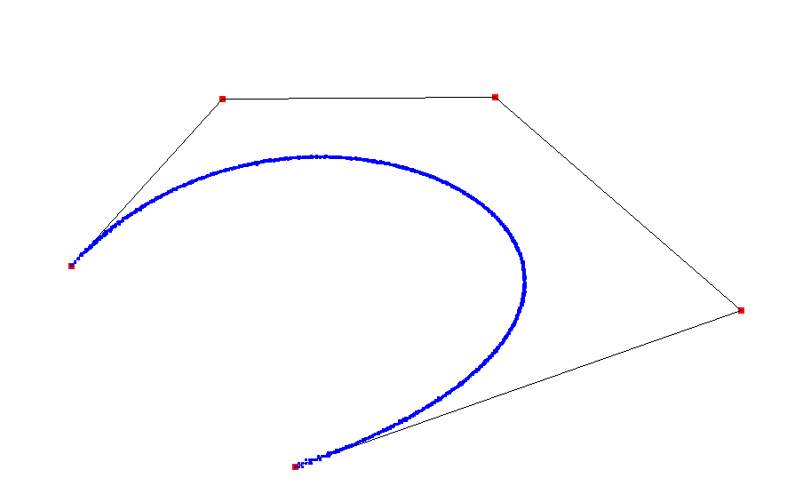

# Running the Code
1. The program was written in Python 3 using the PyQt4 graphics library, which can be installed on Linux systems using the command `sudo apt-get install python3-qt4`. 
2. Run the file using `python3 bezier.py`.
3. Use left click to add new points, right click on existing points to delete them, and use middle click to move points. Middle click on a point, and click on any other location in the canvas - the point will be moved to that location. If you middle clicked on a node by mistake, use `U` to undo your action. 
4. After adding nodes, to draw the Bezier curve, press `D` on your keyboard, use `R` for refresh, and `C` to clear the entire screen. A sample output is shown below.

# Resources Used
This tutorial on [Zetcode](http://zetcode.com/gui/pyqt4) was a pretty good place to start learning PyQt4. After this, it was more or less Googling to figure out whatever was needed. 

# Team Members

1. Rohit Dwivedula (2017A7PS0029H)
2. Shreya Manish Jambavalikar (2018B5A71089H)
3. Prasoon Baghel (2018AAPS0459H)